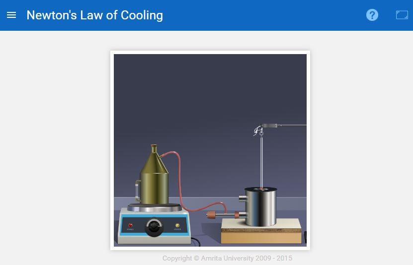
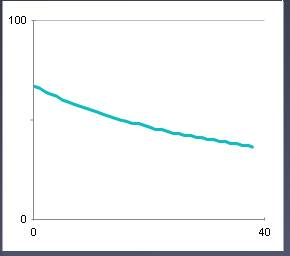
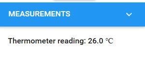

### Procedure

<iframe width="560" height="315" src="https://www.youtube.com/embed/QT9z4JNzHyY" frameborder="0" allow="autoplay; encrypted-media" allowfullscreen></iframe>

### Performing the Simulation

Experimental set up that the user can see on the simulator

#### User Instructions

The simulator consists of three regions:

- Experimental setup
- Variable menu
- Measurements

### Variable Menu

The variable menu contains two drop down combo boxes and two buttons. The user can select the desired material and liquid from these combo boxes. Here select the material (say 'Brass') and liquid (say 'Water'), then click on the Start Heating button. The temperature starts rising. When it reaches the desired temperature (say 80oC) click on the Stop Heating button. When the temperature falls to 70oC, start the stop watch.&nbsp; The time reading is taken for every 5o fall of temperature. The graph is plotted by noting the temperature along the Y axis and time along the X axis.

The graph is shown below. The next is the reset button. It resets the simulator to its default values.
Example :

The user can repeat the experiment to change the material, liquid and temperature TH from the "Variables" section in the simulator.

### Measurement Menu
In the measurement menu the user can view the measured temperature reading and the time for cooling.

## Procedure for Real lab

The calorie meter is filled 2/3rd with the given liquid and is heated to a temperature of 80oC.   This liquid will act as a hot body which is subjected to cooling. The   thermometer is inserted in to the calorimeter. When the temperature   reading is 70oC the stopwatch is started. The time readings are noted for every 5o   fall of temperature up to the room temperature. The readings are   tabulated. A graph is drawn with temperature $(T)$¸ along Y axis and time $(t)$ along X axis, $dT/dt$ is found by taking slopes to tangents drawn at   various temperatures on the cooling curve. Hence Newton's law of cooling   is verified.

### Observations and Calculations

<table>
  <thead>
    <tr>
      <th>Time (s)</th>
      <th>Temperature (°C)</th>
    </tr>
  </thead>
  <tbody>
    <tr>
      <td> $\space$</td>
      <td> $\space$</td>
    </tr>
    <tr>
      <td> $\space$</td>
      <td> $\space$</td>
    </tr>
    <tr>
      <td> $\space$</td>
      <td></td>
    </tr>
  </tbody>
</table>

Slop $dT/dt$ = .......................

## Result
Newton's Law  of Cooling is verified.
