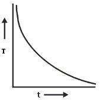
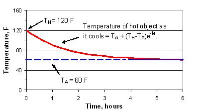

### Theory 

Temperature difference in any situation results from energy flow into a system or energy flow from a system to surroundings. The former leads to heating, whereas latter leads to cooling of an object.
Newton's Law of Cooling states that the rate of temperature of the body is proportional to the difference between the temperature of the body and that of the surrounding medium. This statement leads to the classic equation of exponential decline over time which can be applied to many phenomena in science and engineering, including the discharge of a capacitor and the decay in radioactivity.

Newton's Law of Cooling is useful for studying water heating because it can tell us how fast the hot water in pipes cools off.  A practical application is that it can tell us how fast a water heater cools down if you turn off the breaker when you go on vacation.

Suppose that a body with initial temperature T1°C, is allowed to cool in air which is maintained at a constant temperature T2°C.
Let the temperature of the body be T°C at time t.

Then by Newton's Law of Cooling,

$$\frac{dT}{dt}=-l(T-T_{2})................(1)$$

Where k is a positive proportionality constant. Since the temperature of the body is higher than the temperature of the surroundings then T-T2 is positive. Also the temperature of the body is decreasing i.e. it is cooling down and rate of change of temperature is negative.&nbsp;

$$\frac{dT}{dt}\lt 0$$

The constant $k$ depends upon the surface properties of the material being cooled. Initial condition is given by T=T1 at t=0. 
Solving (1)

$$-kt=log(T-T_{2})+log \space C$$

$$T-T_{2}=Ce^{-kt}...............(2)$$

Applying initial conditions

$$C=T_{1}-T_{2}$$

Substituting the value of C in equation (2) gives

$$T=T_{2}+(T_{1}-T_{2})e^{-kt}$$

This equation represents Newton's law of cooling.

if $k \lt 0$, lim $t \to \infty$, $e^{-kt}=0$ and $T=T_{2}$,

Or we can say that the temperature of the body approaches that of its surroundings as time goes.

  

 

The graph drawn between the temperature of the body and time is known as cooling curve. The slope of the tangent to the curve at any point gives the rate of fall of temperature.

In general,

$$T(t)=T_{A}+(T_{H}-T_{A})e^{-kt}$$

Where,

T(t) = Temperature at time t, 
TA = Ambient temperature (temp of surroundings), 
TH = Temperature of hot object at time 0, 
k = positive constant and 
t = time.

### Example of Newton's Law of Cooling:

This kind of cooling data can be measured and plotted and the results can be used to compute the unknown parameter k. The parameter can sometimes also be derived mathematically.

## Applications

1. To predict how long it takes for a hot object to cool down at a certain temperature.
2. To find the temperature of a soda placed in a refrigerator by a certain amount of time.
3. It helps to indicate the time of death given the probable body temperature at the time of death and current body temperature.

